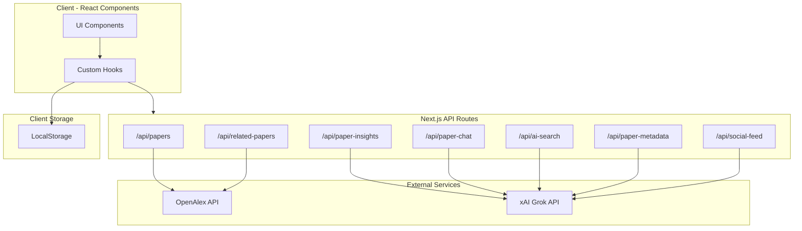

# Synapse - Research Paper Discovery

A modern research paper discovery platform built with Next.js. Synapse aggregates academic papers from OpenAlex and provides AI-powered insights, social context from X/Twitter, and collaborative features like bookmarks and comments.

## Features

- **Paper Search & Discovery**: Search academic papers via OpenAlex API with filtering by citations, date, and study type
- **AI-Powered Insights**: Get paper summaries, ELI5 explanations, and key highlights using xAI's Grok
- **Social Context**: See what researchers are discussing on X/Twitter
- **Collections**: Save and organize papers into custom collections
- **Comments & Voting**: Community discussion and paper voting
- **Paper Chat**: Ask questions about papers and get AI-generated answers

## Prerequisites

- Node.js 20+
- npm

## Setup

1. **Clone and install dependencies**:

   ```bash
   cd synapse-web
   npm install
   ```

2. **Configure environment variables**:

   ```bash
   cp .env.example .env.local
   ```

   Edit `.env.local` and add your API keys:

   | Variable      | Required | Description                                                                       |
   | ------------- | -------- | --------------------------------------------------------------------------------- |
   | `XAI_API_KEY` | No       | xAI API key for AI features. App provides fallback responses when not configured. |

3. **Start the development server**:

   ```bash
   npm run dev
   ```

4. Open [http://localhost:3000](http://localhost:3000) in your browser.

## Available Scripts

| Script                 | Description                  |
| ---------------------- | ---------------------------- |
| `npm run dev`          | Start development server     |
| `npm run build`        | Build for production         |
| `npm run start`        | Start production server      |
| `npm run lint`         | Run ESLint                   |
| `npm run format`       | Format code with Prettier    |
| `npm run format:check` | Check code formatting        |
| `npm run typecheck`    | Run TypeScript type checking |

## Architecture



## Project Structure

```
synapse-web/
├── src/
│   ├── app/
│   │   ├── api/                    # API routes
│   │   │   ├── ai-search/          # AI-powered search intent parsing
│   │   │   ├── paper-chat/         # Paper Q&A chat
│   │   │   ├── paper-insights/     # AI summaries & ELI5
│   │   │   ├── paper-metadata/     # Study type classification
│   │   │   ├── papers/             # OpenAlex paper search
│   │   │   ├── related-papers/     # Related paper discovery
│   │   │   └── social-feed/        # X/Twitter posts
│   │   ├── page.tsx                # Main discovery page
│   │   └── layout.tsx              # Root layout
│   ├── components/
│   │   └── cardiology/             # Paper discovery components
│   ├── hooks/                      # Custom React hooks
│   │   ├── useBookmarks.ts         # Bookmark management
│   │   ├── useCollections.ts       # Collection management
│   │   ├── useComments.ts          # Paper comments
│   │   ├── usePaperMetadata.ts     # Paper metadata fetching
│   │   ├── useUser.ts              # User identity
│   │   └── useVotes.ts             # Paper voting
│   ├── lib/                        # Utility functions
│   │   ├── citations.ts            # BibTeX/APA generation
│   │   └── env.ts                  # Environment helpers
│   └── types/                      # Shared TypeScript types
│       ├── index.ts                # Barrel export
│       └── paper.ts                # Paper-related types
├── .github/workflows/ci.yml        # GitHub Actions CI
├── .editorconfig                   # Editor settings
├── prettier.config.mjs             # Prettier config
├── eslint.config.mjs               # ESLint config
└── tsconfig.json                   # TypeScript config
```

## API Routes

| Endpoint              | Method | Description                           |
| --------------------- | ------ | ------------------------------------- |
| `/api/papers`         | GET    | Search papers via OpenAlex            |
| `/api/paper-insights` | POST   | Generate AI insights for a paper      |
| `/api/paper-chat`     | POST   | Chat with AI about a paper            |
| `/api/paper-metadata` | POST   | Classify paper study type & rigor     |
| `/api/ai-search`      | POST   | Parse natural language search queries |
| `/api/related-papers` | GET    | Find related papers                   |
| `/api/social-feed`    | GET    | Fetch research discussions from X     |

## Development

### Code Quality

This project uses:

- **ESLint** with Next.js + TypeScript rules
- **Prettier** for consistent formatting
- **TypeScript** in strict mode

Run all checks:

```bash
npm run format:check && npm run lint && npm run typecheck
```

### CI/CD

GitHub Actions runs on every push/PR to `main`:

1. Format check
2. Lint
3. Type check
4. Build

## License

Private
